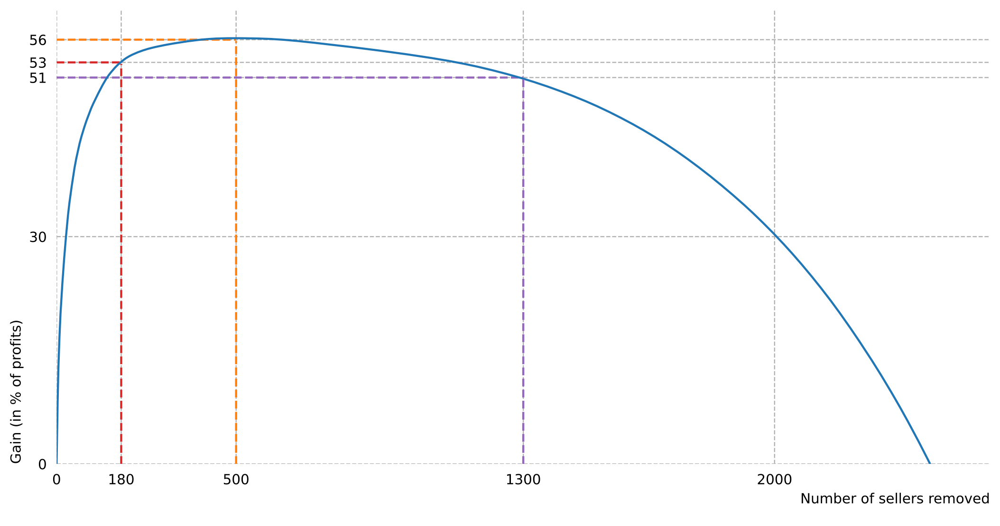
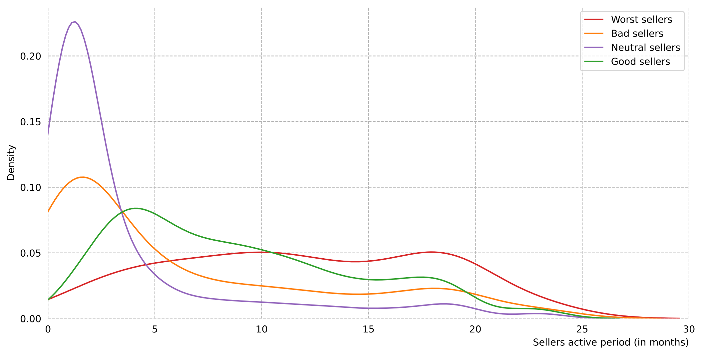
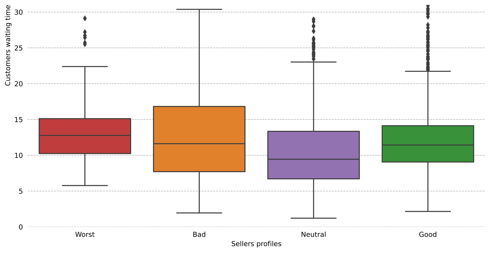
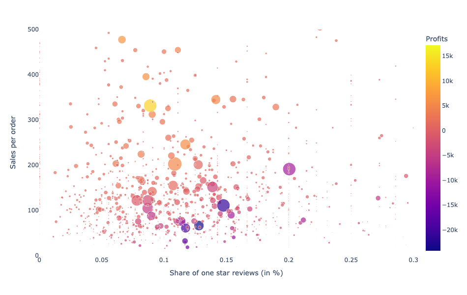

# Olist project
This project is about analyzing a dataset provided by an e-commerce marketplace called [Olist](https://olist.com/) to answer the CEO’s question:

*How to increase customer satisfaction (so as to increase profit margin) while maintaining a healthy order volume?*

This project demonstrates skills about:
- Data sourcing from SQL/CSV files using pandas
- Feature engineering using pandas
- Data visualization & Decision Science using pyplot, seaborn and plotly


# About Olist 🇧🇷


Olist is a leading e-commerce service that connects merchants to main marketplaces in Brazil. They provide a wide range of offers including inventory management, dealing with reviews and customer contacts to logistic services.

Olist charges sellers a monthly fee. This fee is progressive with the volume of orders.

Here are the seller and customer workflows:

**Seller:**

- Seller joins Olist
- Seller uploads products catalogue
- Seller gets notified when a product is sold
- Seller hands over an item to the logistic carrier

**Customer:**

- Browses products on the marketplace
- Purchases products from Olist.store
- Gets an expected date for delivery
- Receives the order
- Leaves a review about the order


# Install

Clone the project and install it:

```bash
git clone git@github.com:aduverger/olist.git
cd olist
pip install -r requirements.txt
make clean install test           # install and test
```


# Download the dataset

The dataset consists of 100k orders from 2016 and 2018 that were made on the Olist store, available as a csv on [Kaggle](https://www.kaggle.com/olistbr/brazilian-ecommerce).

Download the 9 datasets and store them in your ```data/csv``` folder.

The data is provided through csv files yet the structure is similar to SQL.
You can refer to this schema for details:


# Run the notebook

You just have to run the notebook that is inside the ```notebook``` folder to see how we used data science as a tool to identify bad sellers from the Olist store.

Alternatively, you can directly look at [the presentation](./notebooks/final_presentation.html) made with Jupyter.

Here are some examples of the insights that have been made using seaborn and plotly:








